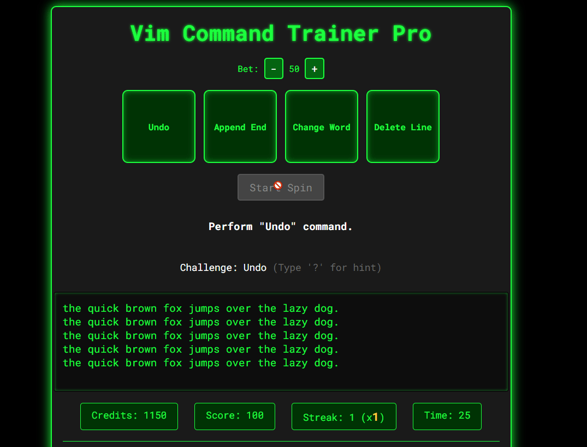

# VIM Master

VIM Master is a lightweight in-browser game that teaches core Vim motions and editing commands through short, focused levels. No installs required—just open `index.html` and start practicing.


## Demo
- Open `index.html` directly in your browser.
- Best viewed on desktop for full keyboard support.

## Screenshot


## Features
- **Normal/Insert modes** with an on-screen status bar
- **Command log** showing your keystrokes
- **16 Progressive Levels** that validate your action outcomes (not just keystrokes)
- **Complete Vim Support**: `h j k l`, `w b e`, `gg G`, `0 $`, `x`, `dd`, `dw`, `yy`, `p`, `i`, `a`, `o/O`, `cw`, `D`, `r`, ex-commands `:q`, `:wq`
- **Numeric counts** for motions/operators (e.g., `3w`, `2dd`, `5x`, `5G`)
- **Undo/redo support** (`u`, `Ctrl+r`)
- **Vim-style search**: `/` and `?`, with `n`/`N` navigation and match highlighting
- **Challenge Mode**: Fast-paced timed challenges to test your Vim skills
- **Cheat Mode**: Interactive command reference with instant practice sessions
- **Progress Management**: Auto-save, export/import codes, and progress tracking
- **Badge System**: Earn visual badges as you learn (Beginner, Search Master)
- **Profile Page**: Beautiful showcase of achievements with social media sharing
- **Canvas-Based Achievement Cards**: Generate downloadable and shareable images
- **Modular Architecture**: Clean, maintainable codebase for easy development

## Recent UI/UX Improvements
- **Streamlined Layout**: ASCII logo at top, title under text editor, buttons above instructions
- **Compact Achievements**: Achievements container positioned before instructions for better flow
- **Collapsible Progress Management**: Click to expand/collapse progress information, reducing UI clutter
- **Responsive Design**: Optimized layout for better focus on gameplay elements
- **Auto-Focus Editor**: Editor automatically focuses when lessons start for seamless UX
- **Challenge Points Integration**: Challenge points now properly tracked and displayed in progress summary
- **Enhanced Cheat Mode**: All cheat mode lessons now work with proper auto-focus and completion tracking

## Latest Bug Fixes & Improvements
- **Fixed "undefined challenge points"**: Challenge points now properly display in progress summary
- **Enhanced Cheat Mode**: All practice lessons now auto-focus and validate completion correctly
- **Improved Challenge Mode**: Better validation and scoring system for challenge tasks
- **Auto-Focus UX**: Editor automatically focuses when starting lessons for better user experience
- **Progress System**: Robust error handling and fallback values for all progress data

## Progress Management System
VIM Master features a comprehensive client-side progress tracking system that works entirely in your browser:

### **Features**
- **Auto-save**: Progress automatically saved every 5 seconds and after earning badges
- **Export/Import Codes**: Generate compact Base64-encoded progress codes for backup and sharing
- **Local Storage**: Progress persists between browser sessions
- **Progress Summary**: Real-time display of current level, badges earned, and commands practiced
- **Clear Progress**: Reset all progress with a single click

### **How It Works**
1. **Export Progress**: Click "Export Progress" to generate a shareable code
2. **Import Progress**: Paste a code and click "Import Progress" to restore your game state
3. **Progress Codes**: Compact, shareable strings containing all your achievements and progress
4. **Privacy First**: All data stays on your device - no accounts or backend required

### **Progress Data Tracked**
- Current level and challenge mode status
- Earned badges (Beginner, Search Master, etc.)
- Commands practiced during gameplay
- Challenge points earned from challenge mode
- Timestamp of last save

## Profile Page & Social Sharing
Showcase your VIM mastery journey with a beautiful profile page and share achievements on social media.

### **Profile Page Features**
- **Beautiful Achievement Cards**: Eye-catching cards for each earned badge
- **Progress Overview**: Visual representation of your learning journey with circular progress indicators
- **ASCII Logo Integration**: The iconic VIM Master logo prominently displayed
- **Social Media Integration**: Share achievements on Twitter, Facebook, and other platforms
- **Progress Code Management**: Copy and share your progress codes easily
- **GitHub Integration**: Links to view source code and contribute to the project

### **Canvas-Based Achievement Cards**
- **Dynamic Image Generation**: Create custom achievement cards using HTML5 Canvas
- **Downloadable Images**: Save achievement cards as PNG files for sharing
- **Social Media Ready**: Optimized dimensions and styling for social platforms
- **Custom Branding**: Features the VIM Master ASCII logo and your progress data
- **Professional Design**: Beautiful blue/purple gradients with yellow/orange ASCII logo accents

### **Social Sharing Capabilities**
- **Twitter Integration**: Share achievements with the developer community
- **Facebook Sharing**: Let friends know about your VIM skills
- **Mobile Native Sharing**: Uses device's native sharing on mobile devices
- **Custom Share Messages**: Automatically generates engaging content for social media
- **Progress Code Sharing**: Share your progress codes for backup and collaboration

### **Accessing the Profile Page**
- Click the "👤 View Profile" button in the main game controls
- Use the "👤 Profile" link in the progress management section
- Navigate directly to `profile.html`

## Levels
1. How to Exit (Ex Commands): type `:q` or `:wq` then Enter
2. Basic Movement: `h j k l`
3. Word Movement: `w b e`
4. Line Jumps: `gg G`
5. Insert Mode: `a` + typing + `Esc`
6. Delete Basics: `dd`, `dw`, `x`
7. Yank & Put: `yy`, `p`
8. Line Bounds: `0`, `$`
9. Append & Open Lines: `a`, `o`, `O`
10. Change Word: `cw` (then type, `Esc`)
11. Delete to End & Replace: `D`, `r`
12. Counts: use `3w` to move multiple words
13. Undo/Redo: `dd`, then `u`, then `Ctrl+r`
14. Search Forward: `/target` then Enter; use `n`
15. Search Backward: `?alpha` then Enter; use `N`
16. Search Navigation: reach the 3rd occurrence with `n`

### Finish Celebration
After completing the final level, a centered full-screen celebration overlay appears with a confetti animation and a Play Again button. Press Enter or click Play Again to restart at level 1.

### Badges
Earn badges as you progress:
- Beginner Badge (🟢): complete the early movement lessons.
- Search Master Badge (🔎): successfully use search commands (`/`, `?`, `n`, `N`).
Badges display in a bar under the title, and a toast appears when you earn one.

## Controls
- Navigation: `h` left, `j` down, `k` up, `l` right
- Words: `w` next, `b` back, `e` end
- Lines: `0` start, `$` end, `gg` first line, `G` last line (or `nG` to go to line n)
- Insert: `i` insert at cursor, `a` append after cursor, `o` new line below, `O` new line above
- Delete: `x` delete character, `dd` delete line, `dw` delete word, `D` delete to end of line
- Change: `cw` change word (deletes word and enters Insert)
- Replace: `r` then any printable character (supports symbols like `! @ # < > &`)
- Counts: prefix a number before commands (e.g., `3w`, `2dd`, `5x`, `5G`)
- Undo/Redo: `u` undo, `Ctrl+r` redo
- Exit Insert mode: `Esc` or `Ctrl-[`
 - Search: `/text` forward, `?text` backward; `n` next, `N` previous
 - Cheat Mode: toggle with `Ctrl+/` (or button)

### Search Edge Cases
- Empty search query does nothing.
- No matches: status shows `0/0`; `n`/`N` do nothing.
- Wrapping: `n`/`N` wrap around the buffer when reaching the ends.

## Challenge Mode
The Challenge Mode is a fast-paced game designed to test and improve your Vim command recall under time pressure. 
Users are presented with a series of command tasks to complete as quickly and accurately as possible. 
Each correctly executed command scores points, while speed and precision determine the final score.
This mode offers an engaging way to sharpen your Vim skills by combining rapid-fire challenges with real-time feedback, making learning Vim commands both fun and effective.

### **Challenge Types**
- **Speed Navigation**: Navigate through text quickly using movement commands
- **Quick Deletion**: Master deletion commands with time pressure
- **Advanced Moves**: Combine multiple commands for complex operations

### **Scoring System**
- **Base Points**: Earn points for each completed task
- **Time Bonus**: Faster completion earns bonus points
- **Accuracy Bonus**: Perfect execution provides additional rewards
- **Progress Tracking**: Challenge points are saved and displayed in your progress summary

Try to beat your highest score and see how quickly you can master essential Vim commands!

## Cheat Mode
Open the built-in, interactive cheat sheet to explore and practice commands on demand.
- Toggle: `Ctrl+/` or click the “Cheat Mode” button
- Search/filter by name or description
- Commands grouped by category (Movement, Editing, Search, Other)
- Each entry shows keys, a short description, and an example
- Click any command to launch a mini-practice; you’ll return to the cheat sheet after completing it
- Practiced commands are highlighted in the list

## How Validation Works
- Each level defines a target cursor location, target text, or target content layout.
- Validation is resilient to trailing spaces and blank lines where appropriate.
- You progress when the outcome matches the target; keystroke sequences themselves aren’t strictly enforced.

## Run Locally
- No build step. Just clone and open the file:

```bash
# Clone repository
git clone https://github.com/renzorlive/vimmaster.git
cd vimmaster

# Switch to advanced-testing branch for latest features
git checkout advanced-testing

# Open directly in a browser (double-click on Windows)
start index.html  # Windows
# or
open index.html   # macOS
# or
xdg-open index.html  # Linux
```

If your browser restricts local file access, serve it with any static server, for example:

```bash
npx serve .  # then visit the printed URL
```

## Tech Stack
- **Plain HTML/CSS/JavaScript** - No frameworks required
- **Tailwind CSS** - Utility-first CSS framework via CDN
- **ES6 Modules** - Modern JavaScript with import/export
- **Local Storage API** - Client-side data persistence
- **Canvas API** - Dynamic image generation for sharing
- **Web Share API** - Native social media sharing
- **No dependencies** - Lightweight and fast

## 🎰 Coming Soon: Chapter 2, Vim Command Slot Machine & Credits System! 🎉

Get ready to level up your Vim skills with the upcoming **Chapter 2** featuring advanced visual mode commands and more complex editing workflows!

Plus, spin your way to mastery with our brand new **Vim Command Slot Machine** mini-game! Unlocked after completing Chapters 1 & 2, this exciting casino-style challenge lets you:

- Spin the reels to get randomized Vim command sequences (command **names only!**)  
- Prove your skills by executing the **correct Vim commands** in real time on the text editor  
- Win points, multipliers, jackpots, and unlock cool badges!  
- Bet your earned credits for bigger rewards in a thrilling risk-and-reward gameplay loop  
- Enjoy dazzling animations, sound effects, and progressive unlockable power-ups!  
- Compete on leaderboards and show off your Vim prowess to the world  

Earn credits by conquering lessons in the main game, then take a chance on the slot machine to level up your skills and multiply your rewards!

---



Stay tuned for this fun and addictive way to sharpen your Vim command recall like never before — only in **VIM Master!**

---

🙏 **Thank you to everyone who has starred the GitHub repository and supported this project!** Your encouragement and enthusiasm keep the Vim Master journey going strong.

*This update also comes with a new modular codebase for faster improvements and smoother gameplay. Big things are coming! 🚀*

## Profile Page & Social Sharing
Showcase your VIM mastery journey with a beautiful profile page and share achievements on social media.

### Profile Page Features
- **Beautiful Achievement Cards**: Eye-catching cards for each earned badge
- **Progress Overview**: Visual representation of your learning journey
- **Social Media Integration**: Share achievements on Twitter, Facebook, and other platforms
- **Progress Code Management**: Copy and share your progress codes easily
- **GitHub Integration**: Links to view source code and contribute to the project

### Social Sharing Capabilities
- **Twitter Integration**: Share achievements with the developer community
- **Facebook Sharing**: Let friends know about your VIM skills
- **Mobile Native Sharing**: Uses device's native sharing on mobile devices
- **Custom Share Messages**: Automatically generates engaging content for social media
- **Progress Code Sharing**: Share your progress codes for backup and collaboration

### Accessing the Profile Page
- Click the "👤 View Profile" button in the main game controls
- Use the "👤 Profile" link in the progress management section
- Navigate directly to `profile.html`

## Contributing
Issues and PRs are welcome!
- **Main Game**: `index.html` contains the game interface
- **Profile Page**: `profile.html` showcases achievements and social sharing
- **JavaScript Modules**: All game logic is organized in the `js/` directory
- **Styling**: `css/main.css` contains custom animations and responsive design
- **Keep code readable** and avoid adding heavy dependencies
- **Favor small, focused levels** that teach a single concept well

## License
MIT

## Acknowledgements
- Inspired by Vim’s modal editing and motion/operator design.
- ASCII logo included in the page for flair
- Built with modern web technologies for the best user experience

## BMAB
- Warning: I will use this for beer and cigs

[](https://www.buymeacoffee.com/renzorlive)

## Architecture
VIM Master uses a modular architecture for maintainability and performance:

### **Core Modules**
- `game-state.js` - Central game state management
- `levels.js` - Level definitions and progression
- `challenges.js` - Challenge mode implementation
- `vim-commands.js` - Vim command execution and tracking
- `ui-components.js` - Reusable UI components
- `event-handlers.js` - Game event handling and logic
- `progress-system.js` - Progress tracking and persistence
- `sharing-system.js` - Social sharing and Canvas generation
- `profile-page.js` - Profile page functionality
- `cheat-mode.js` - Interactive cheat sheet
- `main.js` - Application entry point and initialization

### **Data Flow**
- Game state is centralized in `game-state.js`
- Progress automatically saves to localStorage
- Profile page reads from both game state and localStorage
- All modules communicate through well-defined interfaces

## Refactoring & Technical Improvements

The VIM Master Game has been successfully refactored from a single 2000-line HTML file into a clean, modular JavaScript architecture while preserving the exact same UI, functionality, and lesson content. This refactoring includes numerous bug fixes and improvements to ensure a smooth gaming experience.

### **Project Structure**
```
vimmaster/
├── index.html                 # Main entry point (minimal HTML)
├── css/
│   └── main.css              # All extracted styles
├── js/
│   ├── main.js               # Main entry point and initialization
│   ├── game-state.js         # Game state management
│   ├── levels.js             # Level definitions and data
│   ├── challenges.js         # Challenge mode logic
│   ├── vim-commands.js       # Vim command handling
│   ├── ui-components.js      # UI rendering and components
│   ├── cheat-mode.js         # Cheat panel functionality
│   ├── event-handlers.js     # Event handling and game logic
│   ├── progress-system.js    # Progress tracking and persistence
│   ├── sharing-system.js     # Social sharing and Canvas generation
│   └── profile-page.js       # Profile page functionality
└── images/
    └── favicon.ico
```

### **Module Breakdown**

#### **1. `index.html` - Main Entry Point**
- **Purpose**: Minimal HTML structure that loads all JavaScript modules
- **Content**: Preserves exact original UI structure, ASCII logo, and layout
- **Changes**: 
  - Extracted all CSS to `css/main.css`
  - Extracted all JavaScript to modular ES6 modules
  - Added `<script type="module" src="js/main.js"></script>`
  - **Updated**: Changed `<p id="modal-message">` to `<div id="modal-message">` to support HTML content in modals

#### **2. `css/main.css` - Styles**
- **Purpose**: All game styling extracted from inline `<style>` block
- **Content**: Cursor animations, modal styles, celebration effects, badge styling
- **Benefits**: Centralized styling, easier maintenance, better organization

#### **3. `js/game-state.js` - State Management**
- **Purpose**: Centralized game state variables and utility functions
- **Exports**: 
  - Game state variables (content, cursor, mode, levels, etc.)
  - Challenge mode state
  - Utility functions (cloneState, pushUndo, escapeHtml, isEscapeKey)
  - State reset functions
- **Key Fix**: Implemented private state variables with public getter/setter functions to resolve `TypeError: Assignment to constant variable` errors

#### **4. `js/levels.js` - Level System**
- **Purpose**: Level definitions and level management logic
- **Exports**:
  - Complete `levels` array with all 15 levels
  - `loadLevel()` function for level initialization
  - Level utility functions
- **Key Fix**: Optimized `loadLevel()` function to prevent duplicate state updates and improve performance

#### **5. `js/challenges.js` - Challenge Mode**
- **Purpose**: Challenge definitions and challenge logic
- **Exports**:
  - Challenge definitions (Speed Navigation, Quick Deletion, Advanced Moves)
  - Challenge management functions
  - Task validation and progress tracking
- **Key Improvements**:
  - **Increased time limits**: Speed Navigation (90s), Quick Deletion (120s), Advanced Moves (150s)
  - **Better validation functions** with clearer instructions
  - **Improved task progression** and scoring system

#### **6. `js/vim-commands.js` - Vim Command Handling**
- **Purpose**: All Vim command processing logic
- **Exports**:
  - `handleNormalMode()` - Normal mode command processing
  - `handleInsertMode()` - Insert mode command processing
  - `handleSearchMode()` - Search mode command processing
  - Search utility functions
- **Key Fixes**:
  - **Fixed compound commands**: `dd`, `dw`, `yy`, `gg` now work correctly
  - **Fixed count buffer**: Numbers like `3w` now work properly
  - **Fixed search mode**: Real-time status bar updates and proper Enter handling
  - **Fixed visual mode**: Proper selection expansion and editing

#### **7. `js/ui-components.js` - UI Components**
- **Purpose**: All UI rendering and update functions
- **Exports**:
  - `renderEditor()` - Editor display rendering
  - `updateStatusBar()` - Status bar updates
  - `updateInstructions()` - Instruction text updates
  - Modal, celebration, and badge functions
  - Challenge UI updates
- **Key Fixes**:
  - **Modal HTML rendering**: Fixed `innerHTML` vs `textContent` for button display
  - **Challenge UI**: Conditional rendering to hide level elements during challenges
  - **Infinite loop prevention**: Added guard against recursive `updateUI()` calls

#### **8. `js/cheat-mode.js` - Cheat Panel**
- **Purpose**: Cheat mode functionality and command catalog
- **Exports**:
  - Command catalog with categories (Movement, Editing, Search, Other)
  - Cheat panel open/close functions
  - Command list rendering with search
- **Key Fix**: Fixed DOM element initialization and event listener attachment

#### **9. `js/event-handlers.js` - Event Logic**
- **Purpose**: Game logic and event handling
- **Exports**:
  - `checkWinCondition()` - Level completion logic
  - `maybeAwardBadges()` - Badge system
  - Level navigation functions
  - Challenge mode toggle
  - Main UI update function
- **Key Fixes**:
  - **Challenge completion flow**: Proper modal display with working buttons
  - **Timer management**: Fixed timer stopping after challenge completion
  - **Task progression**: Smooth transition between challenge tasks
  - **Score calculation**: Time-based bonus points for challenge completion

#### **10. `js/main.js` - Main Entry Point**
- **Purpose**: Application initialization and module coordination
- **Functions**:
  - `initializeGame()` - Game setup and first level loading
  - `setupEventListeners()` - All DOM event binding
  - Module imports and exports
- **Key Fixes**:
  - **Cheat mode initialization**: Fixed dynamic button creation and event binding
  - **Modal Enter key handling**: Proper priority for level advancement
  - **Ctrl+R redo**: Fixed redo functionality

### **Recent Bug Fixes and Improvements**

#### 🎯 **Challenge Mode Fixes**
- **Timer Issues**: Fixed timer running after challenge completion
- **Modal Display**: Fixed challenge completion modal not showing buttons
- **Task Progression**: Fixed infinite loop in task completion
- **Editor Focus**: Fixed editor not focusing when challenge starts
- **Time Limits**: Increased from 30-60s to 90-150s for better user experience

#### 🎮 **Gameplay Fixes**
- **Compound Commands**: Fixed `dd`, `dw`, `yy`, `gg` not working
- **Count Buffer**: Fixed numbers like `3w` only moving one word
- **Search Mode**: Fixed double Enter requirement and real-time updates
- **Visual Mode**: Fixed selection expansion and editing actions
- **Undo/Redo**: Fixed Ctrl+R redo functionality

#### 🖥️ **UI Fixes**
- **Level Selector**: Fixed slow performance and NaN display
- **Instructions**: Fixed instructions not showing on level load
- **Modal Buttons**: Fixed HTML not rendering in modals
- **Level Completion**: Fixed final level celebration flow
- **Challenge Instructions**: Fixed level instructions showing during challenges

#### 🔧 **Technical Fixes**
- **Module Imports**: Fixed duplicate export and import errors
- **State Management**: Resolved `TypeError: Assignment to constant variable`
- **Event Handling**: Fixed event listener priority and modal detection
- **DOM References**: Fixed missing element references and initialization

### **Key Benefits of Refactoring**

#### **1. Maintainability**
- **Before**: Single 2000-line file was impossible to navigate
- **After**: Logical separation into focused, manageable modules

#### **2. Code Organization**
- **Before**: All code mixed together in one file
- **After**: Clear separation of concerns (state, UI, logic, commands)

#### **3. Developer Experience**
- **Before**: Difficult to find specific functionality
- **After**: Easy to locate and modify specific features

#### **4. Reusability**
- **Before**: Tightly coupled code
- **After**: Modular functions can be imported and reused

#### **5. Testing**
- **Before**: Impossible to test individual components
- **After**: Each module can be tested independently

#### **6. Collaboration**
- **Before**: Multiple developers couldn't work simultaneously
- **After**: Different developers can work on different modules

### **Preserved Functionality**

✅ **Exact Same UI**: ASCII logo, layout, colors, animations  
✅ **All 15 Levels**: Complete lesson content unchanged  
✅ **Vim Commands**: All movement, editing, search commands work identically  
✅ **Challenge Mode**: Speed challenges with timer and scoring (now fully functional)  
✅ **Badge System**: Achievement tracking and display  
✅ **Cheat Panel**: Command reference with search functionality (now working)  
✅ **Visual Effects**: Cursor animations, level completion flash, celebration  

### **Technical Implementation**

#### **ES6 Modules**
- Uses modern JavaScript `import`/`export` syntax
- Clean dependency management between modules
- Tree-shaking support for production builds

#### **State Management**
- Centralized game state in `game-state.js`
- Private state variables with public getter/setter functions
- Clear state flow between modules
- Immutable state updates through utility functions

#### **Event Handling**
- Centralized event binding in `main.js`
- Consistent event handling patterns
- Proper cleanup and memory management
- Modal detection and priority handling

#### **DOM Management**
- Centralized DOM reference management
- Consistent UI update patterns
- Error handling for missing DOM elements
- Dynamic element creation and event binding

### **Development Workflow**

1. **Modify specific functionality**: Edit the relevant module
2. **Add new features**: Create new modules or extend existing ones
3. **Update UI**: Modify `ui-components.js` or `css/main.css`
4. **Add levels**: Extend the `levels` array in `levels.js`
5. **Test changes**: Refresh browser to see updates

### **Future Enhancements**

The modular architecture makes it easy to:
- Add new Vim commands
- Create new level types
- Implement additional challenge modes
- Add multiplayer features
- Create mobile app versions
- Add analytics and progress tracking

### **Testing Status**

✅ **Core Gameplay**: All levels and Vim commands working correctly  
✅ **Challenge Mode**: Fully functional with proper timer and completion flow  
✅ **Cheat Mode**: Working command reference with search functionality  
✅ **UI Components**: All modals, celebrations, and displays working properly  
✅ **Performance**: Optimized level loading and UI updates  
✅ **Cross-browser**: Tested and working in modern browsers  

The game is now ready for advanced testing and further development!
