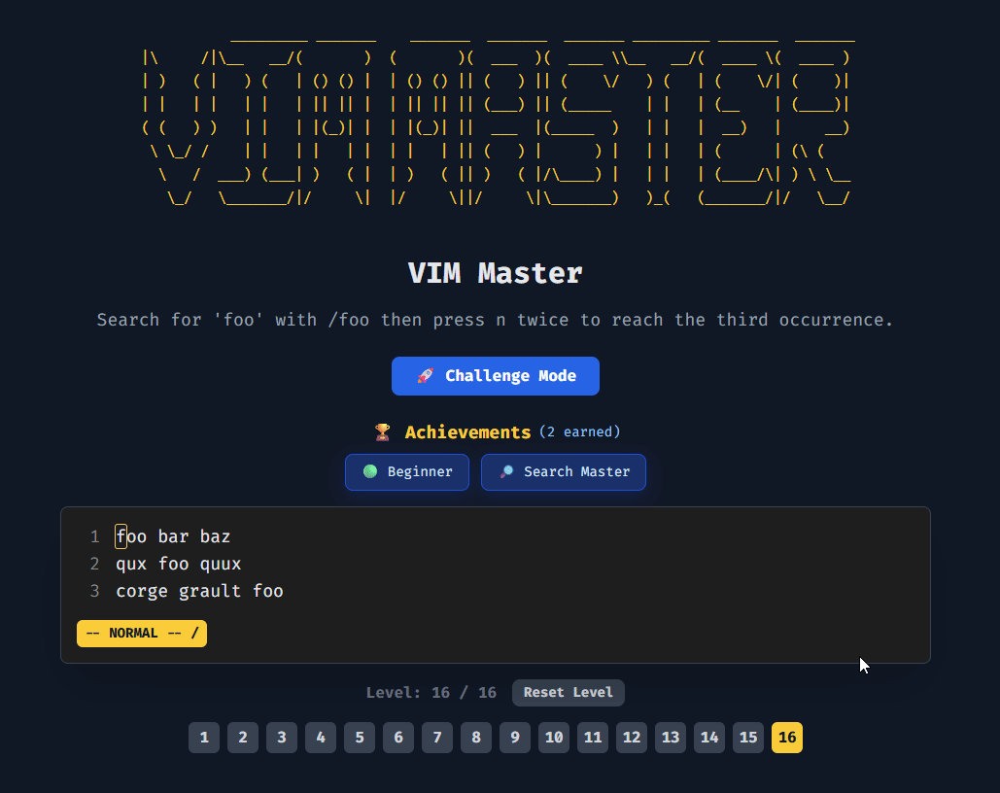
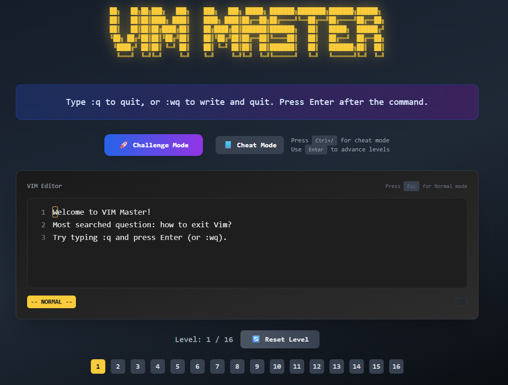

# VIM Master

VIM Master is a lightweight in-browser game that teaches core Vim motions and editing commands through short, focused levels. No installs required—just open `index.html` and start practicing.

## Demo
- Open `index.html` directly in your browser.
- Best viewed on desktop for full keyboard support.

## Try the Online Demo
[](https://renzorlive.github.io/vimmaster/)

> 💡 **Tip:** For the best experience, use a desktop/laptop (full keyboard support).

## Screenshot


## Features
- Normal/Insert modes with an on-screen status bar
- Command log showing your keystrokes
- Levels that validate your action outcomes (not just keystrokes)
- Supports: `h j k l`, `w b e`, `gg G`, `0 $`, `x`, `dd`, `dw`, `yy`, `p`, `i`, `a`, `o/O`, `cw`, `D`, `r`, ex-commands `:q`, `:wq`
- Numeric counts for motions/operators (e.g., `3w`, `2dd`, `5x`, `5G`)
- Undo/redo support (`u`, `Ctrl+r`)
- Completion modal with Enter to advance
 - Ctrl-[ mapped to Escape (exit insert/replace)
 - Vim-style search: `/` and `?`, with `n`/`N` navigation and match highlighting
 - Finish celebration: full-screen overlay with confetti and Play Again
 - Badge system: earn visual badges as you learn (Beginner, Search Master)
 - Cheat Mode: in-game command cheat sheet with quick practice (Ctrl+/)

## Levels
1. How to Exit (Ex Commands): type `:q` or `:wq` then Enter
2. Basic Movement: `h j k l`
3. Word Movement: `w b e`
4. Line Jumps: `gg G`
5. Insert Mode: `a` + typing + `Esc`
6. Delete Basics: `dd`, `dw`, `x`
7. Yank & Put: `yy`, `p`
8. Line Bounds: `0`, `$`
9. Append & Open Lines: `a`, `o`, `O`
10. Change Word: `cw` (then type, `Esc`)
11. Delete to End & Replace: `D`, `r`
12. Counts: use `3w` to move multiple words
13. Undo/Redo: `dd`, then `u`, then `Ctrl+r`
14. Search Forward: `/target` then Enter; use `n`
15. Search Backward: `?alpha` then Enter; use `N`
16. Search Navigation: reach the 3rd occurrence with `n`

### Finish Celebration
After completing the final level, a centered full-screen celebration overlay appears with a confetti animation and a Play Again button. Press Enter or click Play Again to restart at level 1.

### Badges
Earn badges as you progress:
- Beginner Badge (🟢): complete the early movement lessons.
- Search Master Badge (🔎): successfully use search commands (`/`, `?`, `n`, `N`).
Badges display in a bar under the title, and a toast appears when you earn one.

## Controls
- Navigation: `h` left, `j` down, `k` up, `l` right
- Words: `w` next, `b` back, `e` end
- Lines: `0` start, `$` end, `gg` first line, `G` last line (or `nG` to go to line n)
- Insert: `i` insert at cursor, `a` append after cursor, `o` new line below, `O` new line above
- Delete: `x` delete character, `dd` delete line, `dw` delete word, `D` delete to end of line
- Change: `cw` change word (deletes word and enters Insert)
- Replace: `r` then any printable character (supports symbols like `! @ # < > &`)
- Counts: prefix a number before commands (e.g., `3w`, `2dd`, `5x`, `5G`)
- Undo/Redo: `u` undo, `Ctrl+r` redo
- Exit Insert mode: `Esc` or `Ctrl-[`
 - Search: `/text` forward, `?text` backward; `n` next, `N` previous
 - Cheat Mode: toggle with `Ctrl+/` (or button)

### Search Edge Cases
- Empty search query does nothing.
- No matches: status shows `0/0`; `n`/`N` do nothing.
- Wrapping: `n`/`N` wrap around the buffer when reaching the ends.

## Challenge Mode
The Challenge Mode is a fast-paced game designed to test and improve your Vim command recall under time pressure. 
Users are presented with a series of command tasks to complete as quickly and accurately as possible. 
Each correctly executed command scores points, while speed and precision determine the final score.
This mode offers an engaging way to sharpen your Vim skills by combining rapid-fire challenges with real-time feedback, making learning Vim commands both fun and effective.
Try to beat your highest score and see how quickly you can master essential Vim commands!

## Cheat Mode
Open the built-in, interactive cheat sheet to explore and practice commands on demand.
- Toggle: `Ctrl+/` or click the “Cheat Mode” button
- Search/filter by name or description
- Commands grouped by category (Movement, Editing, Search, Other)
- Each entry shows keys, a short description, and an example
- Click any command to launch a mini-practice; you’ll return to the cheat sheet after completing it
- Practiced commands are highlighted in the list

## How Validation Works
- Each level defines a target cursor location, target text, or target content layout.
- Validation is resilient to trailing spaces and blank lines where appropriate.
- You progress when the outcome matches the target; keystroke sequences themselves aren’t strictly enforced.

## Run Locally
- No build step. Just clone and open the file:

```bash
# Clone repository
git clone https://github.com/renzorlive/vimmaster.git
cd vimmaster

# Open directly in a browser (double-click on Windows)
start index.html  # Windows
# or
open index.html   # macOS
# or
xdg-open index.html  # Linux
```

If your browser restricts local file access, serve it with any static server, for example:

```bash
npx serve .  # then visit the printed URL
```

## Tech Stack
- Plain HTML/CSS/JS
- Tailwind CDN for styling
- No dependencies, no frameworks

## About the Refactored Version

The VIM Master game has undergone a major refactor moving from a single-file codebase to a clean, modular architecture based on ES6 modules for improved maintainability, performance, and developer experience.

The refactored version:
- Updated UI & UX, kept functionality and lessons
- Fixes numerous bugs and improves Challenge and Cheat modes
- Improves code organization for easier feature development and testing
- Enables faster iteration and collaboration among developers

You can explore the refactored version on the `advanced-testing` branch or [Demo deployed on Netlify](https://vimmaster.netlify.app/) and provide feedback. We recommend trying the refactored codebase for the best experience and future updates.

For full details, see the [advanced-testing branch README](https://github.com/renzorlive/vimmaster/blob/advanced-testing/README.md) or project documentation.


---

🙏 **Thank you to everyone who has starred the GitHub repository and supported this project!** Your encouragement and enthusiasm keep the Vim Master journey going strong.

*This update also comes with a new modular codebase for faster improvements and smoother gameplay. Big things are coming! 🚀*

## Contributing
Issues and PRs are welcome!
- File: `index.html` contains all the logic and level definitions.
- Keep code readable and avoid adding heavy dependencies.
- Favor small, focused levels that teach a single concept well.

## License
MIT

## Acknowledgements
- Inspired by Vim’s modal editing and motion/operator design.
- ASCII logo included in the page for flair.

## BMAB
- Warning: I will use this for beer and cigs
[](https://www.buymeacoffee.com/renzorlive)