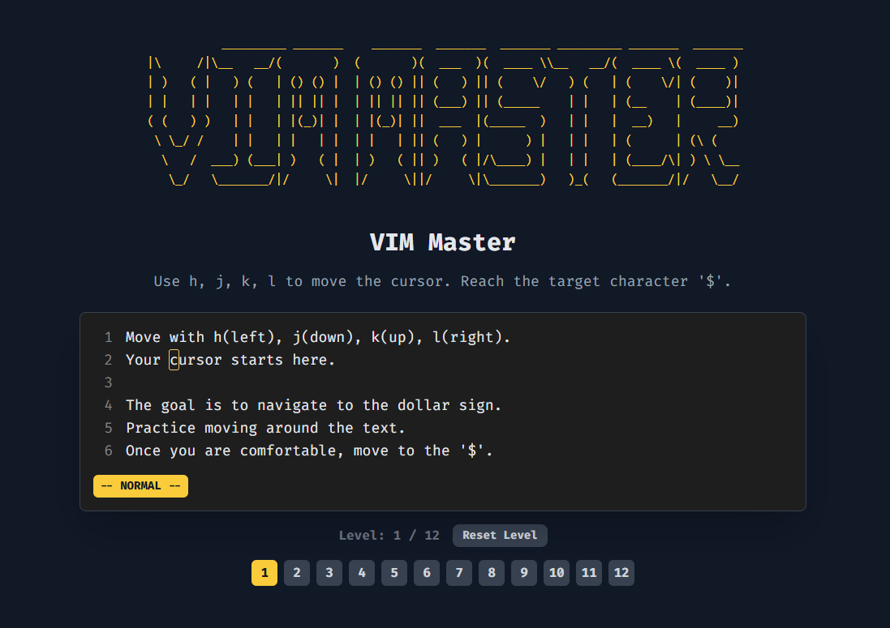

# VIM Master

VIM Master is a lightweight in-browser game that teaches core Vim motions and editing commands through short, focused levels. No installs required—just open `index.html` and start practicing.

## Demo
- Open `index.html` directly in your browser.
- Best viewed on desktop for full keyboard support.

## Screenshot


## Features
- Normal/Insert modes with an on-screen status bar
- Command log showing your keystrokes
- Levels that validate your action outcomes (not just keystrokes)
- Supports: `h j k l`, `w b e`, `gg G`, `0 $`, `x`, `dd`, `dw`, `yy`, `p`, `i`, `a`, `o/O`, `cw`, `D`, `r`, ex-commands `:q`, `:wq`
- Numeric counts for motions/operators (e.g., `3w`, `2dd`, `5x`, `5G`)
- Undo/redo support (`u`, `Ctrl+r`)
- Completion modal with Enter to advance

## Levels
1. How to Exit (Ex Commands): type `:q` or `:wq` then Enter
2. Basic Movement: `h j k l`
3. Word Movement: `w b e`
4. Line Jumps: `gg G`
5. Insert Mode: `a` + typing + `Esc`
6. Delete Basics: `dd`, `dw`, `x`
7. Yank & Put: `yy`, `p`
8. Line Bounds: `0`, `$`
9. Append & Open Lines: `a`, `o`, `O`
10. Change Word: `cw` (then type, `Esc`)
11. Delete to End & Replace: `D`, `r`
12. Counts: use `3w` to move multiple words
13. Undo/Redo: `dd`, then `u`, then `Ctrl+r`

## Controls
- Navigation: `h` left, `j` down, `k` up, `l` right
- Words: `w` next, `b` back, `e` end
- Lines: `0` start, `$` end, `gg` first line, `G` last line (or `nG` to go to line n)
- Insert: `i` insert at cursor, `a` append after cursor, `o` new line below, `O` new line above
- Delete: `x` delete character, `dd` delete line, `dw` delete word, `D` delete to end of line
- Change: `cw` change word (deletes word and enters Insert)
- Replace: `r` then any printable character (supports symbols like `! @ # < > &`)
- Counts: prefix a number before commands (e.g., `3w`, `2dd`, `5x`, `5G`)
- Undo/Redo: `u` undo, `Ctrl+r` redo
- Exit Insert mode: `Esc`

## Challenge Mode
The Challenge Mode is a fast-paced game designed to test and improve your Vim command recall under time pressure. 
Users are presented with a series of command tasks to complete as quickly and accurately as possible. 
Each correctly executed command scores points, while speed and precision determine the final score.
This mode offers an engaging way to sharpen your Vim skills by combining rapid-fire challenges with real-time feedback, making learning Vim commands both fun and effective.
Try to beat your highest score and see how quickly you can master essential Vim commands!

## How Validation Works
- Each level defines a target cursor location, target text, or target content layout.
- Validation is resilient to trailing spaces and blank lines where appropriate.
- You progress when the outcome matches the target; keystroke sequences themselves aren’t strictly enforced.

## Run Locally
- No build step. Just clone and open the file:

```bash
# Clone your fork
git clone https://github.com/<your-username>/vimmaster.git
cd vimmaster

# Open directly in a browser (double-click on Windows)
start index.html  # Windows
# or
open index.html   # macOS
# or
xdg-open index.html  # Linux
```

If your browser restricts local file access, serve it with any static server, for example:

```bash
npx serve .  # then visit the printed URL
```

## Tech Stack
- Plain HTML/CSS/JS
- Tailwind CDN for styling
- No dependencies, no frameworks

## Contributing
Issues and PRs are welcome!
- File: `index.html` contains all the logic and level definitions.
- Keep code readable and avoid adding heavy dependencies.
- Favor small, focused levels that teach a single concept well.

## License
MIT

## Acknowledgements
- Inspired by Vim’s modal editing and motion/operator design.
- ASCII logo included in the page for flair.

## BMAB
- Warning: I will use this for beer and cigs
[](https://www.buymeacoffee.com/renzorlive)
