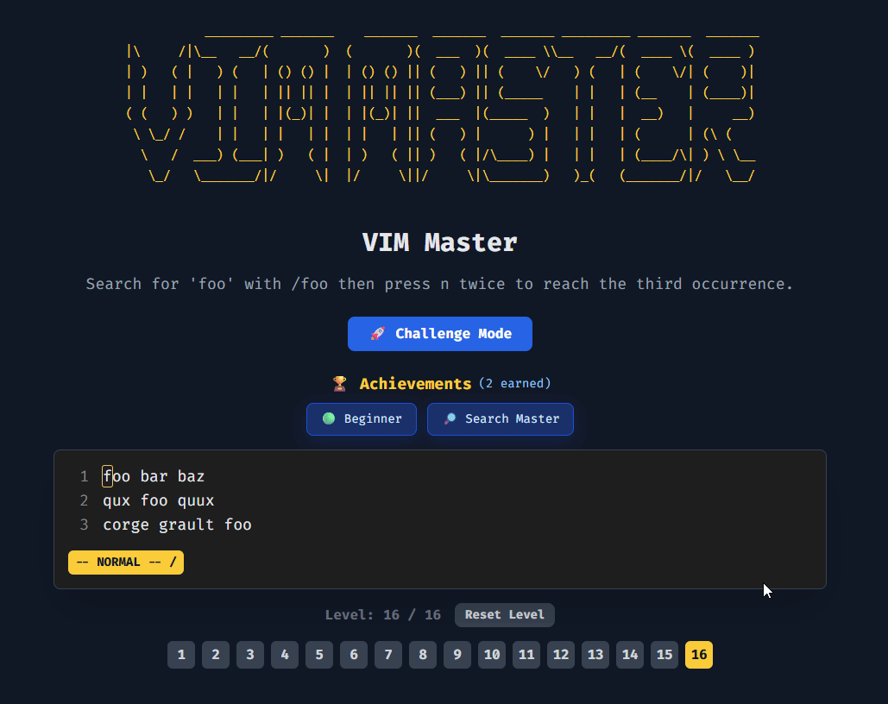

# VIM Master

Learn Vim by playing.

[](https://github.com/renzorlive/vimmaster/actions)
[](https://opensource.org/licenses/MIT)
[](https://github.com/renzorlive/vimmaster/releases/tag/v3.0.0)

<p align="center">
  
</p>

## Features

- 🎮 Learn Vim through interactive lessons
- 🏆 XP & Combo progression
- 📚 JSON-driven lesson system
- ✅ Contract, Golden & Regression tests
- 🌍 Community-ready architecture
- 💾 Offline support

## Quick Start

```bash
git clone https://github.com/renzorlive/vimmaster.git
cd vimmaster
npm install
npm run check
npm start
```

## Project Structure

```
content/     # JSON lessons and schema definitions
docs/        # Community guides, architecture, and principles
js/          # Game engine, progress system, and UI components
tests/       # Contract, Golden, and Regression test suites
```

## Development

```bash
npm run check          # Run all test suites
npm run test           # Run unit tests
npm run build:content  # Compile JSON lessons into generated-content.js
```

## Architecture

- **Content Provider:** Single source of truth for the game engine, feeding dynamically compiled JSON content.
- **Contract Suite:** Validates lesson schemas and schema rules to prevent bad data.
- **Golden Suite:** E2E validation ensuring the engine respects lesson solutions without breaking.
- **Regression Suite:** Protects against previously resolved bugs re-emerging.

## Contributing

Want to add a new lesson or Vim command? You don't need to touch the engine code!  
Read our guide: [Contributing a Lesson](docs/community/contributing-a-lesson.md)

## Roadmap

- ✅ V2 Architecture Freeze
- ✅ Community Alpha
- 🚧 V3 UX Polish
- 🔜 Public Beta

## License

MIT License
